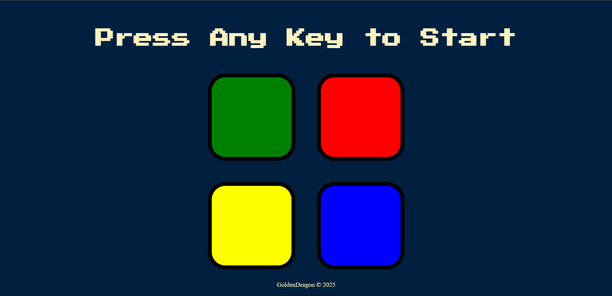

# Friv Sou9 Ra7ba

A frontend-only website featuring some famous games, inspired by the well-known Friv platform. Currently, the website includes two games:

## Chkoba (Tunisian)

The famous Tunisian card game where you face off in a 1v1 match against a bot. There is no difficulty selection — only **God mode**. The bot utilizes advanced search algorithms to predict your most probable hand and select the best moves accordingly.

The engine is built around **seven core functions**:

- **guessCards()**: Returns the most probable hand of cards you can have.
- **legalMoves(state)**: Returns all possible legal moves for a player in the current game state.
- **nextState(state, move)**: Takes the current state and a legal move, returning the resulting new state.
- **evalState(state)**: Evaluates the state and returns a float representing the expected score difference between the two players. The function uses **hypergeometric probability distribution** to estimate the odds of reaching a specific objective.
- **recursiveCreateTree(state, depth)**: Generates a tree of possible game outcomes starting from the initial state.
- **minimax(state, depth, isMaximizing)**: Recursively searches for the best score. It minimizes the evaluation during the bot's turn and maximizes it during the player's turn.
- **botBestMove(state)**: Returns the best possible move for the bot by selecting the move with the lowest evaluation score (most favorable for the bot).

The **evaluation score** is printed in the console — feel free to check it, though it won't give you much of an advantage 😉.

Besides the advanced logic, special care was given to **animations** and **design**, making the game visually appealing.

---

## Simon

The classic **Simon Says** memory game with simple sound and visual effects. Four colors in front of you — memorize the sequence and repeat it to progress through the levels. One mistake, and the game is over!

---

Enjoy the games, and may the odds be ever in your favor!
